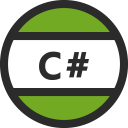

# Visual Studio Code

Visual Studio Code is a lightweight but powerful source code editor which runs on your desktop and is available for Windows, macOS and Linux. It comes with built-in support for JavaScript, TypeScript and Node.js and has a rich ecosystem of extensions for other languages (such as C++, C#, Java, Python, PHP, Go) and runtimes (such as .NET and Unity).

Why VS Code? - Read about the design philosophy and architecture of VS Code.

# Editor VS IDE

| Editor            | IDE Visual Studio  |
| ----------------- | ------------------ |
| Lighweigth/fast   | Project system     |
| file/folders      | Code understanding |
| many languages    | debug              |
| many workflows    | intergrated build  |
| keyboard centered | File>New wizard    |
|                   | designers          |
|                   | ALM integration    |
|                   | platform tools     |

> **Note**: Application Lifetime Management(ALM)

**Editors**: general are light weight and fast they don't have wizards but have many tools to help build projects. Allows for more customizing of tooling and "_combines **simplicity of a code editor** with what developers need for their **code-edit-debug-cyles**_" --Eric Gamma

**IDE**: general are large installs are slower to spin up and install extensions they provide platforming tools for example Azure and have very powerful debuging tools. But the more tools you have built in the slows you down.

Visual studio code gives use some of both worlds by providing some of the features you get in a full IDE in **Visual Studio Code**:

| Visual Studio Code                      |     |
| --------------------------------------- | --- |
| Lighweigth/fast                         |
| file/folders **with project context**   |
| many languages                          |
| many workflows                          |
| keyboard centered                       |
| **code understanding (some languages**) |
| **debug**                               |
| **task running**                        |

# Top Extensions

Enable additional languages, themes, debuggers, commands, and more. VS Code's growing community shares their secret sauce to improve your workflow.

|  |  |  |  |
| --------------------------------------------------------------------------------------------------------------------------------------------- | ---------------------------------------------------------------------------------------------------------------------------------------------------- | ------------------------------------------------------------------------------------------------------------------------------------------------------- | ------------------------------------------------------------------------------------------------------------------------------------------------------ |
| [Python](https://marketplace.visualstudio.com/items?itemName=ms-python.python)                                                                | [C/C++](https://marketplace.visualstudio.com/items?itemName=ms-vscode.cpptools)                                                                      | [ESLint](https://marketplace.visualstudio.com/items?itemName=ms-vscode.atom-keybindings)                                                                | [C#](https://marketplace.visualstudio.com/items?itemName=ms-vscode.vs-keybindings)                                                                     |

|  |  |  |  |
| ----------------------------------------------------------------------------------------------------------------------------------------------------- | --------------------------------------------------------------------------------------------------------------------------------------------------------------------- | -------------------------------------------------------------------------------------------------------------------------------------- | ------------------------------------------------------------------------------------------------------------------------------------------------------------------- |
| [Prettier - Code](https://marketplace.visualstudio.com/items?itemName=esbenp.prettier-vscode)                                                         | [Debugger](https://marketplace.visualstudio.com/items?itemName=msjsdiag.debugger-for-chrome)                                                                          | [Java](https://marketplace.visualstudio.com/items?itemName=redhat.java)                                                                | [vscode-icons](https://marketplace.visualstudio.com/items?itemName=vscode-icons-team.vscode-icons)                                                                  |

Vue VS Code Extensions sarah.drasner
Angular Essentials
React Food Truck

# Agenda

To get the most out of Visual Studio Code, start by reviewing a few introductory topics:

[Setup](https://code.visualstudio.com/) - Install VS Code for your platform and configure the tool set for your development needs.

[Create New .Net Core App](https://github.com/Onemanwolf/visual-studio-2019/blob/master/VisualStudioCode2019_Getting_Started/docs/VisualStudioCode_Create_Project_SDK.md)

[User Interface](https://github.com/Onemanwolf/visual-studio-2019/blob/master/VisualStudioCode2019_Getting_Started/docs/VisualStudioCode_Intro_UI.md) - Introduction to the basic UI, commands, and features of the VS Code editor.

[Settings](https://github.com/Onemanwolf/visual-studio-2019/blob/master/VisualStudioCode2019_Getting_Started/docs/VisualStudioCode_Settings.md) - Customize VS Code for how you like to work.

[Themes](https://github.com/Onemanwolf/visual-studio-2019/blob/master/VisualStudioCode2019_Getting_Started/docs/VisualStudioCode_Themes.md) You can set up many themes and install more.

[Keyboard Shortcuts](https://github.com/Onemanwolf/visual-studio-2019/blob/master/VisualStudioCode2019_Getting_Started/docs/VisualStudioCode_KeyBinding.md)
Increase your productivity with VS Code's keyboard shortcuts.

[Debug](https://github.com/Onemanwolf/visual-studio-2019/blob/master/VisualStudioCode2019_Getting_Started/docs/VisualStudioCode_Debug.md) Debugging code in Visual Studio bring VS Code closer to being an IDE but more like a smart editior.

[Snippets and Emmet](https://github.com/Onemanwolf/visual-studio-2019/blob/master/VisualStudioCode2019_Getting_Started/docs/VisualStudioCode_Snippets_emmit.md) - Jump right in with Tips and Tricks to become a VS Code power user.

[Refactor](https://github.com/Onemanwolf/visual-studio-2019/blob/master/VisualStudioCode2019_Getting_Started/docs/VisualStudioCode_Create_Dotnet_Refactor.md)  Refactor your code  is made simple Visual Studio Code.

Azure - Azure Tooling just works in VS Code.
* Demo

