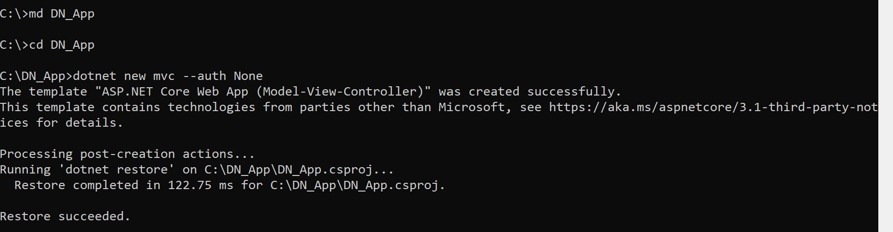
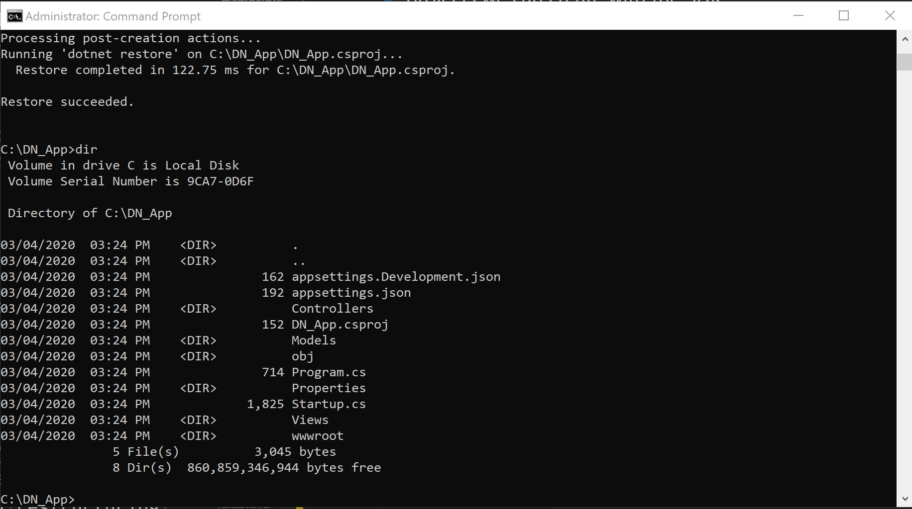

# Create New .Net Core Project

[Install .Net Core SDK](https://dotnet.microsoft.com/download)

1. **Open** a command prompt by typing cmd Windows Search in the Bottom left screen.

2. **Type** `dotnet new` in the cmd prompt.

> **Note**: As you can see by scrolling down the different types of projects we can create with the SDK.

3. First lets make directory for or practice app type `cd C:\` and them `md DN_App`.

4. Now we will create a .Net App by **typing** `dotnet new mvc --auth None`

5. **Type** `Dir` to view the files we created.

6. Now type in the cmd window `code .` and Visual Studio Code will open in the new project.

7. You should be prompted to install Required assets to build and debug are missing from DN_App Add them? **Click** `Yes`.

8. `Ctrl+`` In the terminal type`dotnet run` your app should build and run on port 5001 and 5000.

9. Now we see we have an .Net App up and running. Now in the Visual Code terminal that we ran the app from, type Ctrl+C to shutdown the application.

10. Lets Now take a look around the [Visual Studio Code UI](https://github.com/Onemanwolf/visual-studio-2019/blob/master/VisualStudioCode2019_Getting_Started/docs/VisualStudioCode_Intro_UI.md).

> **Note**: if you have red squiggle lines Crtl+` opens a terminal and type dotnet restore.

> **Note**: Powershell is default you can add different terminals by editing your settings `"terminal.integrated.shell.windows": "cmd.exe"`

Another powerful tool for build app in command line is [Yeoman](https://yeoman.io/learning/)
