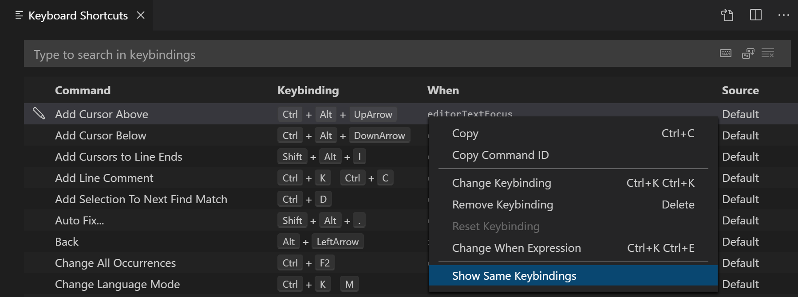
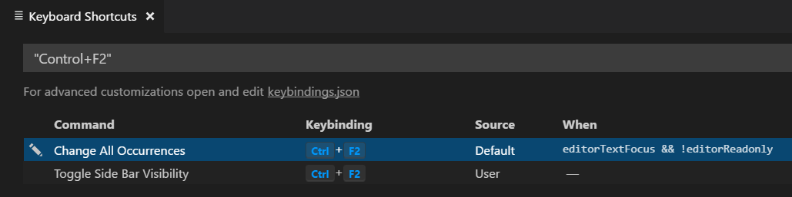
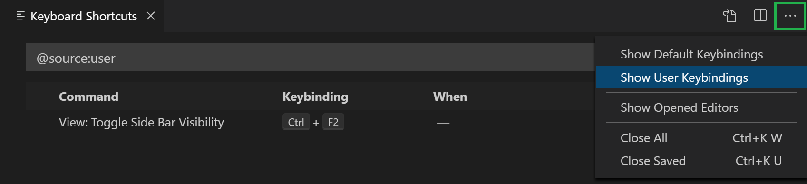
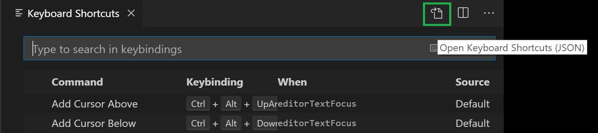
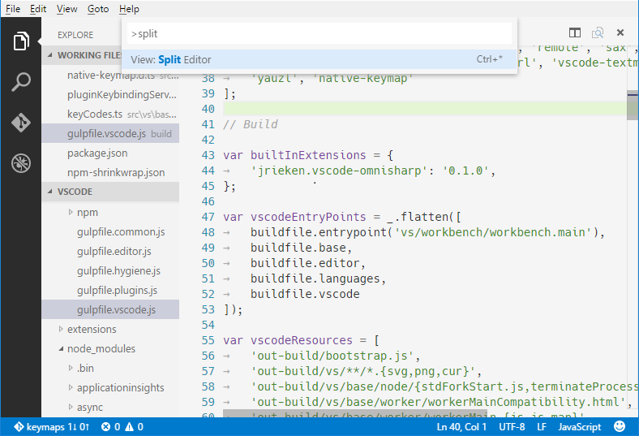
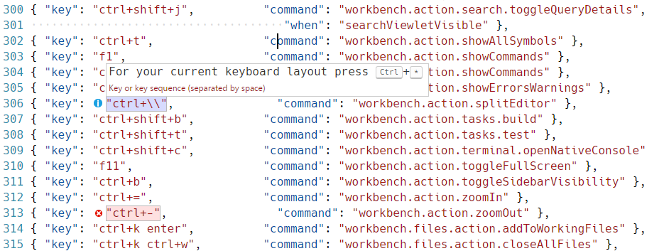
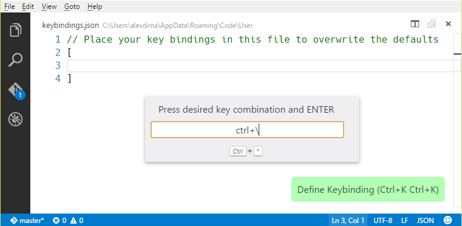
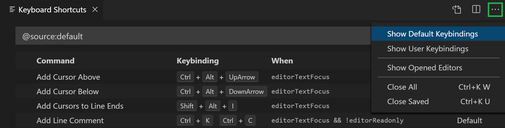

# Key Bindings for Visual Studio Code

Visual Studio Code lets you perform most tasks directly from the keyboard. This page lists out the default bindings (keyboard shortcuts) and describes how you can update them.

>**Note**: If you visit this page on a Mac, you will see the key bindings for the Mac. If you visit using Windows or Linux, you will see the keys for that platform. If you need the key bindings for another platform, hover your mouse over the key you are interested in.

## Keyboard Shortcuts editor

Visual Studio Code provides a rich and easy **keyboard shortcuts** editing experience using Keyboard Shortcuts editor. It lists all available commands with and without keybindings and you can easily change / remove / reset their keybindings using the available actions. It also has a search box on the top that helps you in finding commands or keybindings. You can open this editor by going to the menu under **File** > **Preferences** > **Keyboard Shortcuts**. (**Code** > **Preferences** > **Keyboard Shortcuts** **on** macOS)


Most importantly, you can see keybindings according to your keyboard layout. For example, key binding Cmd+\ in US keyboard layout will be shown as Ctrl+Shift+Alt+Cmd+7 when layout is changed to German. The dialog to enter key binding will assign the correct and desired key binding as per your keyboard layout.

For doing more advanced keyboard shortcut customization, read Advanced Customization.

## Keymap extensions

Keyboard shortcuts are vital to productivity and changing keyboarding habits can be tough. To help with this, **File** > **Preferences** > **Keymap Extensions** shows you a list of popular keymap extensions. These extensions modify the VS Code shortcuts to match those of other editors so you don't need to learn new keyboard shortcuts. There is also a Keymaps category of extensions in the Marketplace.


[](https://marketplace.visualstudio.com/items?itemName=vscodevim.vim)| [](https://marketplace.visualstudio.com/items?itemName=ms-vscode.sublime-keybindings)| [](https://marketplace.visualstudio.com/items?itemName=ms-vscode.atom-keybindings)|[](https://marketplace.visualstudio.com/items?itemName=ms-vscode.vs-keybindings)|
---------|----------|---------|----------|
 [Vim](https://marketplace.visualstudio.com/items?itemName=vscodevim.vim) | [Sumblime Test Keymap](https://marketplace.visualstudio.com/items?itemName=ms-vscode.sublime-keybindings) | [Atom Keymap](https://marketplace.visualstudio.com/items?itemName=ms-vscode.atom-keybindings) | [Visual Studio Keymap](https://marketplace.visualstudio.com/items?itemName=ms-vscode.vs-keybindings)

 >Tip: Click on an extension tile above to read the description and reviews to decide which extension is best for you. See more in the Marketplace.

Keyboard Shortcuts Reference
We also have a printable version of these keyboard shortcuts. Help > Keyboard Shortcut Reference displays a condensed PDF version suitable for printing as an easy reference.

Below are links to the three platform-specific versions:

* Windows
* macOS
* Linux

## Detecting keybinding conflicts

If you have many extensions installed or you have customized your keyboard shortcuts, you can sometimes have keybinding conflicts where the same keyboard shortcut is mapped to several commands. This can result in confusing behavior, especially if different keybindings are going in and out of scope as you move around the editor.

The **Keyboard Shortcuts** editor has a context menu command **Show Same Keybindings**, which will filter the keybindings based on a keyboard shortcut to display conflicts.

 

 Pick a command with the keybinding you think is overloaded and you can see if multiple commands are defined, the source of the keybindings and when they are active.

 

 ## Viewing modified keybindings

You can view any user modified keyboard shortcuts in VS Code in the Keyboard Shortcuts editor with the Show User Keybindings command in the More Actions (...) menu. This applies the @source:user filter to the Keyboard Shortcuts editor (Source is 'User').



## Advanced customization

All keyboard shortcuts in VS Code can be customized via the `keybindings.json` file.

* To configure keyboard shortcuts through the JSON file, open **Keyboard Shortcuts** editor and select the **Open Keyboard Shortcuts (JSON)** button on the right of the editor title bar.
* This will open your keybindings.json file where you can overwrite the Default Keybindings.



You can also open the keybindings.json file from the Command Palette (Ctrl+Shift+P) with the Preferences: Open Keyboard Shortcuts (JSON) command.

## Keyboard rules

The keyboard shortcuts dispatching is done by analyzing a list of rules that are expressed in JSON. Here are some examples:****

```json
// Keybindings that are active when the focus is in the editor
{ "key": "home",            "command": "cursorHome",                  "when": "editorTextFocus" },
{ "key": "shift+home",      "command": "cursorHomeSelect",            "when": "editorTextFocus" },

// Keybindings that are complementary
{ "key": "f5",              "command": "workbench.action.debug.continue", "when": "inDebugMode" },
{ "key": "f5",              "command": "workbench.action.debug.start",    "when": "!inDebugMode" },

// Global keybindings
{ "key": "ctrl+f",          "command": "actions.find" },
{ "key": "alt+left",        "command": "workbench.action.navigateBack" },
{ "key": "alt+right",       "command": "workbench.action.navigateForward" },

// Global keybindings using chords (two separate keypress actions)
{ "key": "ctrl+k enter",    "command": "workbench.action.keepEditor" },
{ "key": "ctrl+k ctrl+w",   "command": "workbench.action.closeAllEditors" },
```
Each rule consists of:

* a `key` that describes the pressed keys.
* a `command` containing the identifier of the command to execute.
* an **optional** `when` clause containing a boolean expression that will be evaluated depending on the current **context**.
Chords (two separate keypress actions) are described by separating the two keypresses with a space. For example, `Ctrl+K` `Ctrl+C`.

When a key is pressed:

the rules are evaluated from **bottom** to **top**.
the first rule that matches, both the `key` and in terms of `when`, is accepted.
no more rules are processed.
if a rule is found and has a `command` set, the `command` is executed.
The additional `keybindings.json` rules are appended at runtime to the bottom of the default rules, thus allowing them to overwrite the default rules. The `keybindings.json` file is watched by VS Code so editing it while VS Code is running will update the rules at runtime.

## Accepted keys

The `key` is made up of modifiers and the key itself.

The following modifiers are accepted:


Platform | Modifiers |
---------|----------|
 macOS | `Ctrl+`, `Shift+`, `Alt+`, `Cmd+`
 Windows | `Ctrl+`, `Shift+`, `Alt+`,` Win+`
 Linux | `Ctrl+`, `Shift+`, `Alt+`,` Meta+`


 The following keys are accepted:

* f1-f19, a-z, 0-9
* `, -, =, [, ], \, ;, ', ,, ., /
* left, up, right, down, pageup, pagedown, end, home
* tab, enter, escape, space, backspace, delete
* pausebreak, capslock, insert
* numpad0-numpad9, numpad_multiply, numpad_add, numpad_separator
* numpad_subtract, numpad_decimal, numpad_divide

## Command arguments

You can invoke a command with arguments. This is useful if you often perform the same operation on a specific file or folder. You can add a custom keyboard shortcut to do exactly what you want.

The following is an example overriding the `Enter` key to print some text:

```json
{
  "key": "enter",
  "command": "type",
  "args": { "text": "Hello World" },
  "when": "editorTextFocus"
}
```

The type command will receive `{"text": "Hello World"}` as its first argument and add "Hello World" to the file instead of producing the default command.

For more information on commands that take arguments, refer to [Built-in Commands](https://code.visualstudio.com/api/references/commands).

## Removing a specific key binding rule

You can write a key binding rule that targets the removal of a specific default key binding. With the `keybindings.json`, it was always possible to redefine all the key bindings of VS Code, but it can be difficult to make a small tweak, especially around overloaded keys, such as Tab or Escape. To remove a specific key binding, add a `-` to the `command` and the rule will be a removal rule.

Here is an example:

```json
// In Default Keyboard Shortcuts
...
{ "key": "tab", "command": "tab", "when": ... },
{ "key": "tab", "command": "jumpToNextSnippetPlaceholder", "when": ... },
{ "key": "tab", "command": "acceptSelectedSuggestion", "when": ... },
...


// To remove the second rule, for example, add in keybindings.json:
{ "key": "tab", "command": "-jumpToNextSnippetPlaceholder" }
```

## Keyboard layouts

>**Note**: This section relates only to key bindings, not to typing in the editor.

The keys above are string representations for virtual keys and do not necessarily relate to the produced character when they are pressed. More precisely:

* Reference: Virtual-Key Codes (Windows)
* tab for VK_TAB (0x09)
* ; for VK_OEM_1 (0xBA)
* = for VK_OEM_PLUS (0xBB)
* , for VK_OEM_COMMA (0xBC)
* `-` for VK_OEM_MINUS (0xBD)
* . for VK_OEM_PERIOD (0xBE)
* / for VK_OEM_2 (0xBF)
* ` for VK_OEM_3 (0xC0)
* [ for VK_OEM_4 (0xDB)
* \ for VK_OEM_5 (0xDC)
* ] for VK_OEM_6 (0xDD)
* ' for VK_OEM_7 (0xDE)
* etc.

Different keyboard layouts usually reposition the above virtual keys or change the characters produced when they are pressed. When using a different keyboard layout than the standard US, Visual Studio Code does the following:

All the key bindings are rendered in the UI using the current system's keyboard layout. For example, `Split Editor` when using a French (France) keyboard layout is now rendered as `Ctrl+*`:



When editing `keybindings.json`, VS Code highlights misleading key bindings, those that are represented in the file with the character produced under the standard US keyboard layout, but that need pressing keys with different labels under the current system's keyboard layout. For example, here is how the **Default Keyboard Shortcuts** rules look like when using a French (France) keyboard layout:




There is also a widget that helps input the key binding rule when editing `keybindings.json`. To launch the Define Keybinding widget, press `Ctrl+K` `Ctrl+K`. The widget listens for key presses and renders the serialized JSON representation in the text box and below it, the keys that VS Code has detected under your current keyboard layout. Once you've typed the key combination you want, you can press `Enter` and a rule snippet will be inserted.



>**Note**: On Linux, Visual Studio Code detects your current keyboard layout on start-up and then caches this information. For a good experience, we recommend restarting VS Code if you change your keyboard layout.

Keyboard layout-independent bindings
Using scan codes, it is possible to define keybindings which do not change with the change of the keyboard layout. For example:

{
  "key": "cmd+[Slash]",
  "command": "editor.action.commentLine",
  "when": "editorTextFocus"
}
Accepted scan codes:

* [F1]-[F19], [KeyA]-[KeyZ], [Digit0]-[Digit9]
* [Backquote], [Minus], [Equal], [BracketLeft],  [BracketRight], [Backslash], [Semicolon], [Quote],  [Comma], [Period], [Slash]
* [ArrowLeft], [ArrowUp], [ArrowRight], [ArrowDown], [PageUp], [PageDown], [End], [Home]
* [Tab], [Enter], [Escape], [Space], [Backspace],  [Delete]
* [Pause], [CapsLock], [Insert]
* [Numpad0]-[Numpad9], [NumpadMultiply], [NumpadAdd], * [NumpadComma]
* [NumpadSubtract], [NumpadDecimal], [NumpadDivide]

# 'when' clause contexts

VS Code gives you fine control over `when` your key bindings are enabled through the optional when clause. If your key binding doesn't have a `when` clause, the key binding is globally available at all times. A `when` clause evaluates to either Boolean true or false for enabling key bindings.

# Conditional operators

| Operator | Symbol| Example |
|-----|--------|------------|
| Equality | `==` | `"editorLangId == typescript"` |
| Inequality | `!=` | `"editorLangId == typescript"` |
| Or |  &#124; &#124;  | `"editorLangId == typescript"` |
| And | `&&` | `"editorLangId == typescript"` |


# Context

Below are some of the possible when clause contexts which evaluate to Boolean true/false.

| Context name | True when |
|-----|---------------|
| Editor contexts  |  |
| `editorFocus`| An editor has focus, either the text or a widget. |
| `editorTextFocus`| The text in an editor has focus (cursor is blinking). |
| `textInputFocus`| Any editor has focus (regular editor, debug REPL, etc.). |
| `inputFocus`| Any text input area has focus (editors or text boxes). |
| `editorHasSelection`| Text is selected in the editor. |
| `editorHasMultipleSelections`| Multiple regions of text are selected (multiple cursors). |
| `editorReadonly`| The editor is read only. |
| `editorLangId`| True when the editor's associated language Id matches. Example: "editorLangId == typescript". |
| `isInDiffEditor`| The active editor is a difference editor. |
| Operating system contexts  |  |
| `isLinux`| True when the OS is Linux |
| `isMac`| True when the OS is macOS |
| `isWindows`| True when the OS is Windows |
| `isWeb`| True when accessing the editor from the Web |
| Mode contexts  |  |
| `inDebugMode`| A debug session is running. |
| `debugType`| True when debug type matches. Example: "debugType == 'node'". |
| `inSnippetMode`| The editor is in snippet mode. |
| `inQuickOpen`| The Quick Open drop-down has focus. |
| Resource contexts |  |
| `resourceScheme`| True when the resource Uri scheme matches. Example: "resourceScheme == file" |
| `resourceFilename`| True when the Explorer or editor filename matches. Example: "resourceFilename == gulpfile.js" |
| `resourceExtname`| True when the Explorer or editor filename extension matches. Example: "resourceExtname == .js" |
| `resourceLangId`| True when the Explorer or editor title language Id matches. Example: "resourceLangId == markdown" |
| `isFileSystemResource`| True when the Explorer or editor file is a file system resource that can be handled from a file system provider |
| `resourceSet`| True when an Explorer or editor file is set |
| `resource`| The full Uri of the Explorer or editor file |
| Explorer contexts  |  |
| `findWidgetVisible`| True if Explorer view is visible. |
| `explorerViewletFocus`| True if Explorer view has keyboard focus. |
| `filesExplorerFocus`| True if File Explorer section has keyboard focus. |
| `openEditorsFocus`| True if OPEN EDITORS section has keyboard focus. |
| `explorerResourceIsFolder`| True if a folder is selected in the Explorer. |
| Editor widget contexts  |  |
| `explorerViewletVisible`| Editor Find widget is visible. |
| `suggestWidgetVisible`| Suggestion widget (IntelliSense) is visible. |
| `suggestWidgetMultipleSuggestions`| Multiple suggestions are displayed. |
| `renameInputVisible`| Rename input text box is visible. |
| `referenceSearchVisible`| Peek References peek window is open. |
| `inReferenceSearchEditor`| The Peek References peek window editor has focus. |
| `config.editor.stablePeek`| Keep peek editors open (controlled by editor.stablePeek setting). |
| `quickFixWidgetVisible`| Quick Fix widget is visible. |
| `parameterHintsVisible`| Parameter hints are visible (controlled by editor.parameterHints.enabled setting). |
| `parameterHintsMultipleSignatures`| Multiple parameter hints are displayed. |
| Integrated terminal contexts  |  |
| `terminalFocus`| An integrated terminal has focus. |
| `terminalIsOpen`| An integrated terminal is opened. |
| Global UI contexts  |  |
| `notificationFocus`| Notification has keyboard focus. |
| `notificationCenterVisible`| Notification Center is visible at the bottom right of VS Code. |
| `notificationToastsVisible`| Notification toast is visible at the bottom right of VS Code. |
| `searchViewletVisible`| Search view is open. |
| `sideBarVisible`| Side Bar is displayed. |
| `sideBarFocus`| Side Bar has focus. |
| `panelFocus`| Panel has focus. |
| `inZenMode`| Window is in Zen Mode. |
| `isCenteredLayout`| Editor is in centered layout mode. |
| `inDebugRepl`| Focus is in the Debug Console REPL. |
| `workspaceFolderCount`| Count of workspace folders. |
| `replaceActive`| Search view Replace text box is open. |
| `view`| True when view identifier matches. Example: "view == myViewsExplorerID". |
| `viewItem`| True when viewItem context matches. Example: "viewItem == someContextValue". |
| `isFullscreen`| True when window is in fullscreen. |
| `focusedView`| The identifier of the currently focused view. |
| `canNavigateBack`| True if it is possible to navigate back. |
| `canNavigateForward`| True if it is possible to navigate forward. |
| `canNavigateToLastEditLocation`| True if it is possible to navigate to the last edit location. |
| Global Editor UI contexts  |  |
| `textCompareEditorVisible`| At least one diff (compare) editor is visible. |
| `textCompareEditorActive`| A diff (compare) editor is active. |
| `editorIsOpen`| True if one editor is open. |
| `groupActiveEditorDirty`| True when the active editor in a group is dirty. |
| `groupEditorsCount`| Number of editors in a group. |
| `activeEditorGroupEmpty`| True if the active editor group has no editors. |
| `activeEditorGroupIndex`| Index of the active editor in an group (beginning with 1). |
| `activeEditorGroupLast`| True when the active editor in an group is the last one. |
| `multipleEditorGroups`| True when multiple editor groups are present. |
| `editorPinned`| True when the active editor in a group is pinned (not in preview mode). |
| `activeEditor`| The identifier of the active editor in a group. |
| Configuration settings contexts |  |
| `config.editor.minimap.enabled`| True when the setting editor.minimap.enabled is true. |

>**Note**: You can use any user or workspace setting that evaluates to a boolean here with the prefix "config.".


The list above isn't exhaustive and you may see some when contexts for specific VS Code UI in the Default Keyboard Shortcuts.

## Active/Focused view or panel 'when' clause context

You can have a keybinding that is enabled only when a specific view or panel is visible.

| Context name | True when |
|-----|---------------|
| Editor contexts  |  |
| activeViewlet | True when view is visible. Example: "activeViewlet == 'workbench.view.explorer'" |
| activePanel | True when panel is visible. Example: "activePanel == 'workbench.panel.output'" |
| focusedView | True when view is focused. Example: "focusedView == myViewsExplorerID |

View Identifiers:

* workbench.view.explorer - File Explorer
* workbench.view.search - Search
* workbench.view.scm - Source Control
* workbench.view.debug - Debug
* workbench.view.extensions - Extensions

Panel Identifiers:

* workbench.panel.markers - Problems
* workbench.panel.output - Output
* workbench.panel.repl - Debug Console
* workbench.panel.terminal - Integrated Terminal
* workbench.panel.comments - Comments
* workbench.view.search - Search when search.location is set to panel

If you want a keybinding that is enabled only when a specific view or panel has focus, use sideBarFocus or panelFocus in combination with activeViewlet or activiewFocus.

For example, the when clause below is true only when the File Explorer has focus:

```json
"sideBarFocus && activeViewlet == 'workbench.view.explorer'"
```

### key-value when clause operator
There is a key-value pair operator for when clauses. The expression key =~ value treats the right hand side as a regular expression to match against the left hand side. For example, to contribute context menu items for all Docker files, one could use:

```json
   "when": "resourceFilename =~ /docker/"
```

### Custom keybindings for refactorings

The `editor.action.codeAction` command lets you configure keybindings for specific [Refactorings](https://code.visualstudio.com/docs/editor/refactoring) (Code Actions). For example, the keybinding below triggers the **Extract function** refactoring Code Actions:

```json
{
  "key": "ctrl+shift+r ctrl+e",
  "command": "editor.action.codeAction",
  "args": {
    "kind": "refactor.extract.function"
  }
}
```
This is covered in depth in the [Refactoring](https://code.visualstudio.com/docs/editor/refactoring#_keybindings-for-code-actions) topic where you can learn about different kinds of Code Actions and how to prioritize them in the case of multiple possible refactorings.

## Default Keyboard Shortcuts

You can view all default keyboard shortcuts in VS Code in the **Keyboard Shortcuts** editor with the **Show Default Keybindings** command in the **More Actions** (...) menu. This applies the `@source:default` filter to the **Keyboard Shortcuts** editor (**Source** is 'Default').



You can view the default keyboard shortcuts as a JSON file using the command **Preferences** : **Open Default** **Keyboard Shortcuts (JSON)**.

>**Note**: The following keys are rendered assuming a standard US keyboard layout. If you use a different keyboard layout, please [read below](#Keyboard-layouts). You can view the currently active keyboard shortcuts in VS Code in the Command Palette (View -> Command Palette) or in the Keyboard Shortcuts editor (File > Preferences > Keyboard Shortcuts).

Some commands included below do not have default keyboard shortcuts and so are displayed as `unassigned` but you can assign your own keybindings.


# Basic Editing

| Key | Command| Command id |
|-----|---------------|------------|
| `Ctrl+X`| Cut line (empty selection) | `editor.action.clipboardCutAction` |
|     |        |            |


