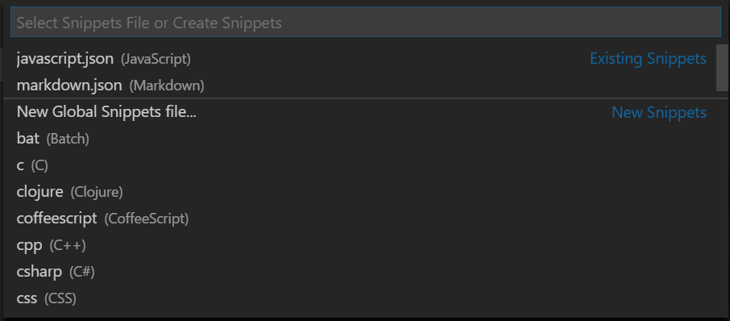

# Snippets in Visual Studio Code

Code snippets are templates that make it easier to enter repeating code patterns, such as loops or conditional-statements.

In Visual Studio Code, snippets appear in IntelliSense (Ctrl+Space) mixed with other suggestions, as well as in a dedicated snippet picker (Insert Snippet in the Command Palette). There is also support for tab-completion: Enable it with "editor.tabCompletion": "on", type a snippet prefix, and press Tab to insert a snippet.

The snippet syntax follows the TextMate snippet syntax with the exceptions of 'interpolated shell code' and the use of \u; both are not supported.

# Create your own snippets

You can easily define your own snippets without any extension. To create or edit your own snippets, select User Snippets under File > Preferences (Code > Preferences on macOS), and then select the language (by language identifier) for which the snippets should appear, or the New Global Snippets file option if they should appear for all languages. VS Code manages the creation and refreshing of the underlying snippets file(s) for you.




Snippets files are written in JSON, support C-style comments, and can define an unlimited number of snippets. Snippets support most TextMate syntax for dynamic behavior, intelligently format whitespace based on the insertion context, and allow easy multiline editing.

Below is an example of a for loop snippet for JavaScript:

```json
"publicclass": {
	"description": "class constructor",
	"prefix": "class-public",
	"body": [
		"public class ${1: ClassName} {",
		"",
		"   $0",
		"\tpublic string ${2: Prop1}{get; set;}",
		"\tpublic int ${3: Prop2} {get;set;}",
		"",
		"\t${1: ClassName}(string prop1,int prop2){",
		"\t${2: Prop1} = prop1;",
		"\t${3: Prop2} = prop2;",
		"",
		"\t}",
		"}"
		]
	}

```

# Install snippets from the Marketplace

Many extensions on the VS Code [Marketplace](https://marketplace.visualstudio.com/search?term=snippets&target=VSCode&category=All%20categories&sortBy=Relevance) include snippets. If you find one you want to use, install it and restart VS Code and the new snippet will be available (see Extension Marketplace for more instructions on installing an extension).

# Emmet in Visual Studio Code

Emmet support is built right into Visual Studio Code, no extension is required. Emmet 2.0 has support for the majority of the Emmet Actions including expanding Emmet abbreviations and snippets.

## How to expand Emmet abbreviations and snippets

Emmet abbreviation and snippet expansions are enabled by default in `html, haml, jade, slim, jsx, xml, xsl, css, scss, sass, less` and `stylus` files. As well as any language that inherits from any of the above like `handlebars` and `php`.


When you start typing an Emmet abbreviation, you will see the abbreviation displayed in the suggestion list. If you have the suggestion documentation fly-out open, you will see a preview of the expansion as you type. If you are in a stylesheet file, the expanded abbreviation shows up in the suggestion list sorted among the other CSS suggestions.

## Using Tab for Emmet expansions

If you want to use the `Tab` key for expanding the Emmet abbreviations, add the following setting:

```json
"emmet.triggerExpansionOnTab": true
```

This setting allows using the Tab key for indentation when text is not an Emmet abbreviation.

## Emmet when quickSuggestions are disabled

If you have disabled the `editor.quickSuggestions` [setting](https://code.visualstudio.com/docs/getstarted/settings), you won't see suggestions as you type. You can still trigger suggestions manually by pressing `Ctrl+Space` and see the preview.

## Disable Emmet in suggestions

If you don't want to see Emmet abbreviations in suggestions at all, then use the following setting:

```json
"emmet.showExpandedAbbreviation": "never"
```

You can still use the command Emmet: Expand Abbreviation to expand your abbreviations. You can also bind any keyboard shortcut to the command id `editor.emmet.action.expandAbbreviation` as well.

## Emmet suggestion ordering

To ensure Emmet suggestions are always on top in the suggestion list, add the following settings:

```json
"emmet.showSuggestionsAsSnippets": true,
"editor.snippetSuggestions": "top"
```

# Emmet abbreviations in other file types

To enable the Emmet abbreviation expansion in file types where it is not available by default, use the `emmet.includeLanguages` setting. Make sure to use [language identifiers](https://code.visualstudio.com/docs/languages/identifiers) for both sides of the mapping.

For example:

```json
"emmet.includeLanguages": {
    "javascript": "javascriptreact",
    "vue-html": "html",
    "razor": "html",
    "plaintext": "jade"
}
```

Emmet has no knowledge of these new languages, and so you might feel Emmet suggestions showing up in non HTML/CSS context. To avoid this, you can use the following setting.

```json
"emmet.showExpandedAbbreviation": "inMarkupAndStylesheetFilesOnly"
```

>**Note**: If you used emmet.syntaxProfiles previously to map new file types, from VS Code 1.15 onwards you should use the setting emmet.includeLanguages instead. emmet.syntaxProfiles is meant for customizing the final output only.

Emmet with multi-cursors
You can use most of the Emmet actions with multi-cursors as well:


[Refactor](https://github.com/Onemanwolf/visual-studio-2019/blob/master/VisualStudioCode2019_Getting_Started/docs/VisualStudioCode_Create_Dotnet_Refactor.md)