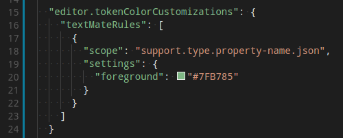
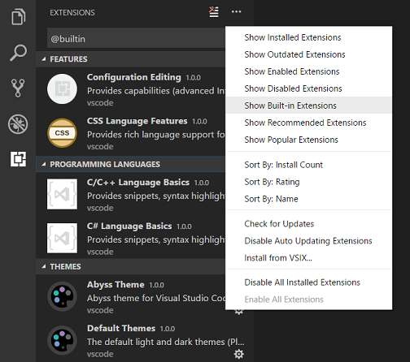
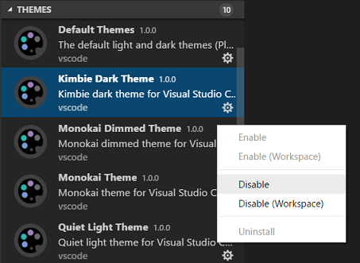

# Color Themes

Color themes let you modify the colors in Visual Studio Code's user interface to suit your preferences and work environment.


## Selecting the Color Theme

1. In VS Code, open the Color Theme picker with **File** > **Preferences** > **Color Theme. (Code > Preferences** > **Color Theme** on macOS).
2. You can also use the keyboard shortcut `Ctrl+K` `Ctrl+T` to display the picker.
3. Use the cursor keys to preview the colors of the theme.
4. Select the theme you want and press `Enter`.


The active color theme is stored in your user [settings](https://code.visualstudio.com/docs/getstarted/settings) (keyboard shortcut `Ctrl+`,).

```powershell
  // Specifies the color theme used in the workbench.
  "workbench.colorTheme": "Default Dark+"
```  
>Tip: By default, the theme is stored in your user settings and applies globally to all workspaces. You can also configure a workspace specific theme. To do so, set a theme in the Workspace [settings](https://code.visualstudio.com/docs/getstarted/settings#_creating-user-and-workspace-settings).

## Color Themes from the Marketplace

There are several out-of-the-box color themes in VS Code for you to try.

Many more themes have been uploaded to the VS Code [Extension Marketplace](https://code.visualstudio.com/docs/editor/extension-gallery) by the community. If you find one you want to use, install it and restart VS Code and the new theme will be available.

Tip: To search for themes, type 'theme' in the Extensions view (`Ctrl+Shift+X`) search box.


| Extension      | |
|:----------------|----------------------------:|
| [vscode-icons](https://marketplace.visualstudio.com/items?itemName=vscode-icons-team.vscode-icons)|[](https://marketplace.visualstudio.com/items?itemName=vscode-icons-team.vscode-icons)
|[Material Icon Theme](https://marketplace.visualstudio.com/items?itemName=vscode-icons-team.vscode-icons)| [](https://marketplace.visualstudio.com/items?itemName=PKief.material-icon-theme)|
|[One Dark Pro](https://marketplace.visualstudio.com/items?itemName=zhuangtongfa.Material-theme)| [](https://marketplace.visualstudio.com/items?itemName=zhuangtongfa.Material-theme)|
|[Material Theme](https://marketplace.visualstudio.com/items?itemName=Equinusocio.vsc-material-theme)| [](https://marketplace.visualstudio.com/items?itemName=Equinusocio.vsc-material-theme)|

You can also browse the VS Code Marketplace site directly to find available themes.

# Customizing a Color Theme
You can customize your active color theme with the `workbench.colorCustomizations` and `editor.tokenColorCustomizations` user [settings](https://code.visualstudio.com/docs/getstarted/settings).

To set the colors of VS Code UI elements such as list & trees (File Explorer, suggestions widget), diff editor, Activity Bar, notifications, scroll bar, split view, buttons and more, use `workbench.colorCustomizations`.


You can use IntelliSense while setting `workbench.colorCustomizations` values or, for a list of all customizable colors, see the Theme Color Reference.

To customize a specific theme only, use the following syntax:

```powershell
"workbench.colorCustomizations": {
    "[Monokai]": {
        "sideBar.background": "#347890"
    }
}
```

To tune the editor's syntax highlighting colors, use `editor.tokenColorCustomizations` in your user settings `settings.json` file:


A pre-configured set of syntax tokens ('comments', 'strings', ...) is available for the most common constructs. If you want more, you can do so by directly specifying TextMate theme color rules:



Note: Directly configuring TextMate rules is an advanced skill as you need to understand on how TextMate grammars work. Go to the Color Theme guide for more information.

Again, to customize a specific theme only, use the following syntax:

"editor.tokenColorCustomizations": {
    "[Monokai]": {
        "comments": "#229977"
    }
},
# Creating your own Color Theme

Creating and publishing a theme extension is quite easy. Customize your colors in your user settings then generate a theme definition file with the **Developer: Generate Color Theme From Current Settings** command.

VS Code's Yeoman [extension generator](https://code.visualstudio.com/api/get-started/your-first-extension) will help you generate the rest of the extension.

See the [Create a new Color Theme](https://code.visualstudio.com/api/extension-guides/color-theme#create-a-new-color-theme) topic in our Extension API section to learn more.

## Remove default themes

If you'd like to remove some of the default themes shipped with VS Code from the Color Theme picker, you can disable them from the Extensions view (Ctrl+Shift+X). Open the ... More Actions drop-down menu from the top of the Extensions view, select Show Built-in Extensions, and you'll see a THEMES section listing the default themes.



You can disable a built-in theme extension as you would any other VS Code extension with the Disable command on the gear context menu.



# Icon Themes

File icon themes can be contributed by extensions and selected by users as their favorite set of file icons. File icons are shown in the File Explorer and tabbed headings.

## Selecting the File Icon Theme

In VS Code, open the File Icon Theme picker with File > Preferences > File Icon Theme. (Code > **Preferences** > **File Icon Theme** on macOS).
You can also use the **Preferences**: **File Icon Theme** command from the **Command Palette** (`Ctrl+Shift+P`).
Use the cursor keys to preview the icons of the theme.
Select the theme you want and hit `Enter`.


By default, the **Seti** file icon set is used and those are the icons you see in the File Explorer. Once an icon theme is selected, the selected theme will be remembered and appear again whenever VS Code is restarted. You can disable file icons by selecting **None**.

VS code ships with two icon themes; **Minimal** and **Seti**. To install more icon themes, select the **Install** **Additional File Icon Themes** item in the icon theme picker and you'll see a query for file icon themes (tag:icon-theme) in the Extensions view.

You can also browse the [VS Code Marketplace](https://marketplace.visualstudio.com/search?target=vscode&category=Themes&sortBy=Installs) site directly to find available themes.

The active File Icon theme is persisted in your user [settings](https://code.visualstudio.com/docs/getstarted/settings) (keyboard shortcut `Ctrl+,`).

```powershell
  // Specifies the icon theme used in the workbench.
  "workbench.iconTheme": "vs-seti"
```

# Creating your own File Icon Theme

You can create your own File [Icon Theme](https://code.visualstudio.com/api/extension-guides/icon-theme) from icons (preferably SVG), see the Icon Theme topic in our Extension API section for details.

## Next steps

Themes are just one way to customize VS Code. If you'd like to learn more about VS Code customization and extensibility, try these topics:

* [Settings](https://code.visualstudio.com/docs/getstarted/settings) - Learn how to configure VS Code to your preferences through user and workspace settings.
* [Snippets](https://code.visualstudio.com/docs/editor/userdefinedsnippets) - Add additional snippets to your favorite language.
* [Extension API](https://code.visualstudio.com/api) - Learn about other ways to extend VS Code.
* [Color Theme](https://code.visualstudio.com/api/extension-guides/color-theme) - Color Theme extension API.
* [Icon Theme](https://code.visualstudio.com/api/extension-guides/icon-theme) - Icon Theme extension API.